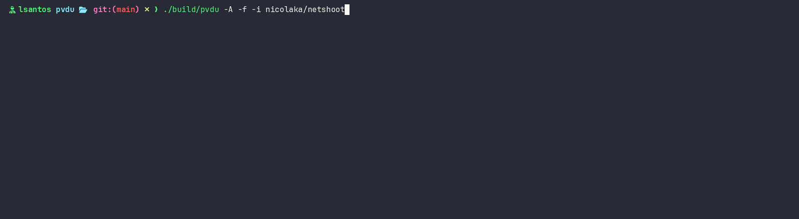

# pvdu — PVC Disk Usage

Real storage usage of Kubernetes PVCs. Compares requested capacity, PV size, and actual filesystem usage via a parallel directory scanner uploaded to pods.

Built on [dirwalker](https://github.com/NeutryFD/dirwalker) — a parallel, depth-aware directory scanner.

## Demo



## Quick start

```bash
make build
./build/pvdu usage -n default
./build/pvdu usage -n default -o table
./build/pvdu usage -n monitoring -p data-thanos-receive-0
./build/pvdu usage -n monitoring -f -i nicolaka/netshoot
./build/pvdu usage -A --concurrency=10
```

## Usage flags

| Flag | Short | Default | Description |
|------|-------|---------|-------------|
| `--namespace` | `-n` | `default` | Kubernetes namespace |
| `--all-namespaces` | `-A` | | Scan all namespaces |
| `--pvc` | `-p` | | Filter by PVC name |
| `--force` | `-f` | | Auto-create temp pod when exec into existing pod fails |
| `--image` | `-i` | `alpine:latest` | Image for temp pods |
| `--timeout` | `-t` | `120s` | Timeout for temp pod creation + scan |
| `--concurrency` | `-c` | `3` | Max parallel PVC scans |
| `--max-depth` | `-d` | `0` (unlimited) | Scanner directory depth |
| `--exclude` | `-e` | | Paths to exclude from scan (repeatable) |
| `--workers` | `-w` | `0` (auto) | Scanner parallel workers |
| `--files` | | | Report individual file sizes in scan output |
| `--context` | | | Kubernetes context |
| `--kubeconfig` | | | Path to kubeconfig file |
| `--output` | `-o` | `default` | Output format: `default`, `table`, `json`, `yaml` |
| `--log-level` | | | Log level: `debug`, `info`, `warn`, `error` |

## Output formats

```bash
./build/pvdu -n default              # Columnar output (no borders, no colors)
./build/pvdu -n default -o table     # ASCII table with borders
./build/pvdu -n default -o json      # JSON array of results
./build/pvdu -n default -o yaml      # YAML output
```

The `default` format shows each PVC on one line with columns: NAMESPACE, POD, PVC, PATH, REQUESTED, PV SIZE, USED, %. Progress is printed to stderr during scanning and cleared when complete.

## Build

```bash
make build    # Builds scanner, embeds it into pvdu, produces single binary
make test     # Builds scanner, runs unit + integration tests
make clean    # Removes build artifacts
```

`make build` produces a single `build/pvdu` binary with the scanner embedded at compile time via `//go:embed`. No external files needed at runtime — copy and run from anywhere.
